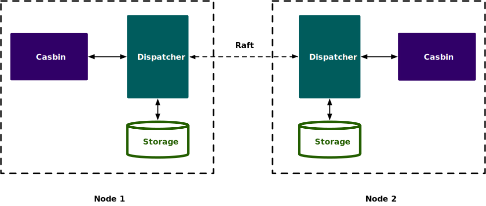

# hraft-dispatcher 

[](https://goreportcard.com/report/github.com/casbin/hraft-dispatcher)
[](https://github.com/casbin/hraft-dispatcher/actions?workflow=main)
[](https://pkg.go.dev/github.com/casbin/hraft-dispatcher)
[](https://github.com/casbin/hraft-dispatcher/releases)
[](https://sourcegraph.com/github.com/casbin/hraft-dispatcher?badge)
[](https://github.com/casbin/hraft-dispatcher/blob/main/LICENSE)

A dispatcher based on Hashicorp's Raft for Casbin.

## Project Status

hraft-dispatcher is beta version.

## Getting started

### Installation

Go version 1.14+ and Casbin vervsion 2.24+ is required.

```shell
go get github.com/casbin/hraft-dispatcher
```

### Prerequisite

You have to provide a completely new Casbin environment without Adapter, all the policies are handled by hraft-dispatcher. 
When the leader node starts for the first time, you can add the default policy to hraft-dispatcher.

### Example

An example is provided [here](./example).

### Security

We support enable TLS on HTTP service and Raft service. 
If you provide the TLS config is not nil, we will configure this to HTTP service and Raft service, and the HTTP upgrade HTTPS.

when TLS is enabled, a peer certificate must be provided. It is recommended to use [cfssl](https://github.com/cloudflare/cfssl) to generate this certificate, our generate script is [here](./testdata/ca/generate.sh).

Here is out configuration, you can find it in [example](./example/main.go):
```go
tls.Config{
    RootCAs:      rootCAPool,
    ClientCAs:    rootCAPool,
    ClientAuth:   tls.RequireAndVerifyClientCert,
    Certificates: []tls.Certificate{cert},
}
```

## Architecture

hraft-dispatcher is a [dispatcher](https://casbin.org/docs/dispatchers/) plug-in based on [hashicorp/raft](https://github.com/hashicorp/raft) implementation.

hraft-dispatcher includes an HTTP service, and a Raft service:

- HTTP service is used to forward data from follower node to follower node
- Raft service is used to maintain the policy consistency of each node

If you set up a dispatcher in Casbin, it forwards the following request to dispatcher:

- AddPolicy
- RemovePolicy
- AddPolicies
- RemovePolicies
- RemoveFilteredPolicy
- UpdatePolicy
- UpdatePolicies
- ClearPolicy

In dispatcher, we are use Raft consensus protocol to maintain the policy, and use the [bbolt](https://github.com/etcd-io/bbolt) to storage the policy of each node.

hraft-dispatcher overall architecture looks like this:



## Limitations

- Adapter: You cannot use Adapter in Casbin, hraft-dispatcher has its own Adapter, which uses the [bbolt](https://github.com/etcd-io/bbolt) to storage the policy.
- You cannot call the following methods, which will affect data consistency:
  - LoadPolicy - All policies are maintained by hraft-dispatcher
  - SavePolicy - All policies are maintained by hraft-dispatcher


## Project reference

Much of the inspiration comes from the following projects:

- [rqlite](https://github.com/rqlite/rqlite)
- [vault](https://github.com/hashicorp/vault)

Thanks for everyone's contribution.

## Contribution

Thank you for your interest in contributing!

## License

This project is under Apache 2.0 License. See the [LICENSE](LICENSE) file for the full license text.
